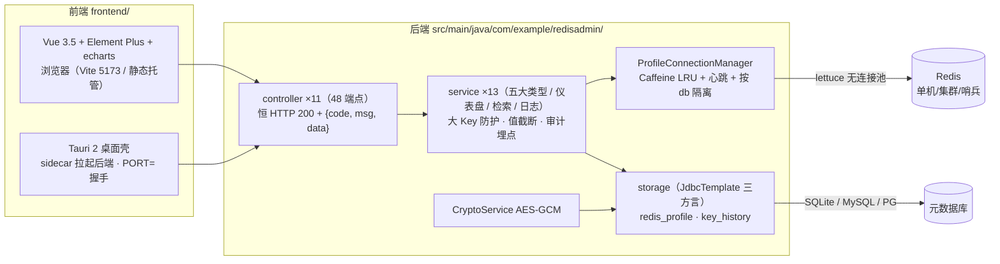

# Redis 可视化管理平台

简体中文 | [English](README_EN.md)

Spring Boot 3.4.6 + Lettuce 7.8.0 后端，Vue 3.5 + Element Plus 前端（可打包为 Tauri 2 桌面应用）。
支持单机 / 集群 / 哨兵连接管理、五大类型 CRUD、只读监控、跨实例仪表盘、实时检索与操作日志。

> ⚠️ 本服务持有全部已配置 Redis 实例的读写权限， **仅限受控内网部署**；暴露公网前必须自行加网关鉴权。

## 架构



技术栈：JDK 21 · Spring Boot 3.4.6 · Lettuce 7.8.0.RELEASE（钉版）· Netty 4.2.17.Final（钉版）· Caffeine 3.1.8 ·
前端 Vue 3.5 / TS 5.9 / Vite 6 / Element Plus 2.14 / vue-i18n 11 / echarts 5（pnpm 12，vitest 45 用例）· 桌面壳 Tauri 2。

```
redisVisual-backend/
├── src/main/java/com/example/redisadmin/
│   ├── config/       AppProperties / CacheConfig / PortAnnouncer / SchedulingConfig / StartupValidator / WebMvcConfig
│   ├── controller/   11 个控制器、48 端点（profiles/dashboard/keys/五类型/server/history/search）
│   ├── service/      业务编排 + 大 Key 闸门 + 审计埋点（含 TypeFilterScanArgs）
│   ├── redis/        连接管理域：三形态建连 / 按 db 隔离 / LRU / 心跳 / 超时三件套
│   ├── storage/      redis_profile · key_history CRUD + 三方言 DDL + 版本化迁移
│   ├── security/     CryptoService（AES-GCM 凭据加密）
│   ├── web/          @ProfileId 路径解析器（统一鉴权注入点）
│   ├── model/        13 DTO + 29 VO
│   └── exception/    ErrorCode（5 位）/ BizException / GlobalExceptionHandler
├── frontend/         Vue 3 前端（pnpm）+ src-tauri/ 桌面壳
├── docs/             backend-design.md（接口契约权威口径）/ system-design.md / frontend-design.md
└── data/             app.db + app.key（运行时生成，勿提交）
```

## 使用方法

### 后端

```bash
mvn clean package -DskipTests
java -jar target/redisVisual-1.0.0.jar     # 默认数据目录 <cwd>/data/
```

- **数据目录**：`java -jar app.jar --app.db-path=/data/redis/app.db`（或位置参数 `/data/redis/app.db`）
- **备份**：首次启动生成 `data/app.db`（SQLite）与 `data/app.key`（凭据密钥）， **两者必须同目录一起备份，丢失密钥 =
  全部密码不可解**
- **导入存量连接**：`java -jar app.jar --import-connections=/path/to/connections.json`（导入后删除明文源文件）
- **启动不要求 Redis 可达**：无可达实例时照常启动，`StartupValidator` 只汇报不退出

### 前端

```bash
cd frontend
pnpm install
pnpm dev      # http://localhost:5173，/api 代理到 8080
pnpm build    # vue-tsc 类型检查 + vite 构建
pnpm test     # vitest 单测
```

### 桌面应用（Tauri 2）

```bash
cd frontend
pnpm tauri dev      # 开发：Rust 壳 + 后端 sidecar
pnpm tauri build    # 打包（resources/app.jar 与 jlink runtime 由 CI 注入）
```

桌面握手：后端以 `--announce-port` 启动时，web server 就绪后向 stdout 打印 `PORT=<n>`（`PortAnnouncer`），
Rust 壳逐行扫描该行并通知前端切换 baseURL；裸跑 `java -jar` 时零输出、行为不变。

### API

11 控制器 / 48 端点，全部 **HTTP 200** + `{code, msg, data}`（错误只看 `code`，细分语义看 `msg`）：

- 连接配置 `/api/profiles`（CRUD + validate + databases）
- 仪表盘 `/api/dashboard/overview · topology/{id} · memory-trend · load-trend`
- Key 治理与五类型 `/api/c/{id}/keys | strings | lists | hashes | sets | zsets`
- 只读监控 `/api/c/{id}/server/*`（info / clients / slowlog / dbsize / overview）
- 操作日志 `GET /api/history/keys` · 实时检索 `GET /api/search/keys`

完整契约（路径 / 参数 / 错误码 / VO）见 **`docs/backend-design.md`**；明确不提供
`CONFIG SET` / `FLUSHDB` / `FLUSHALL` / `KEYS` / `SHUTDOWN`。

### 配置

全部配置收敛在 `application.yml`（前缀 `redis-admin`）：存储类型、连接超时、大 Key 阈值、日志保留等，
逐项默认值与说明见 `docs/backend-design.md` §7。

## 文档

| 文档                                 | 内容                                     |
|--------------------------------------|------------------------------------------|
| `docs/backend-design.md`             | 接口契约唯一权威口径（48 端点逐项定义）  |
| `docs/system-design.md`              | 内部机制与实现取舍（含踩坑与技术债清单） |
| `docs/2026-10-06-frontend-design.md` | 前端设计（v3：契约基准 + 落地状态）      |
