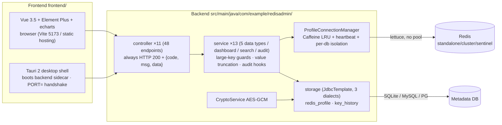

# Redis Visualizer

English | [简体中文](README.md)

A Spring Boot 3.4.6 + Lettuce 7.8.0 backend with a Vue 3.5 + Element Plus frontend (packaged as a Tauri 2 desktop
app). Connection management for standalone / cluster / sentinel, CRUD for the five core data types, read-only server
monitoring, a cross-instance dashboard, live key-space search, and operation audit logging.

> ⚠️ This service holds full read/write access to every configured Redis instance — **intranet only**. Add gateway
> authentication before any public exposure.

## Architecture



Tech stack: JDK 21 · Spring Boot 3.4.6 · Lettuce 7.8.0.RELEASE (pinned) · Netty 4.2.17.Final (pinned) · Caffeine 3.1.8 ·
frontend Vue 3.5 / TS 5.9 / Vite 6 / Element Plus 2.14 / vue-i18n 11 / echarts 5 (pnpm 12, 45 vitest cases) · Tauri 2
shell.

```
redisVisual-backend/
├── src/main/java/com/example/redisadmin/
│   ├── config/       AppProperties / CacheConfig / PortAnnouncer / SchedulingConfig / StartupValidator / WebMvcConfig
│   ├── controller/   11 controllers, 48 endpoints (profiles/dashboard/keys/5 types/server/history/search)
│   ├── service/      orchestration + large-key gates + audit hooks (incl. TypeFilterScanArgs)
│   ├── redis/        connection domain: 3-mode clients / per-db isolation / LRU / heartbeat / timeout stack
│   ├── storage/      redis_profile · key_history CRUD + 3-dialect DDL + versioned migration
│   ├── security/     CryptoService (AES-GCM credential encryption)
│   ├── web/          @ProfileId resolver (unified auth injection point)
│   ├── model/        13 DTOs + 29 VOs
│   └── exception/    ErrorCode (5-digit) / BizException / GlobalExceptionHandler
├── frontend/         Vue 3 frontend (pnpm) + src-tauri/ desktop shell
├── docs/             backend-design.md (authoritative API contract) / system-design.md / frontend-design.md
└── data/             app.db + app.key (generated at runtime, do not commit)
```

## Usage

### Backend

```bash
mvn clean package -DskipTests
java -jar target/redisVisual-1.0.0.jar     # default data dir <cwd>/data/
```

- **Data directory**: `java -jar app.jar --app.db-path=/data/redis/app.db` (or positional arg `/data/redis/app.db`)
- **Backup**: first launch creates `data/app.db` (SQLite) and `data/app.key` (credential key) — **both must be backed up
  together in the same directory; losing the key makes every stored password undecryptable**
- **Legacy import**: `java -jar app.jar --import-connections=/path/to/connections.json` (delete the plaintext source
  afterwards)
- **Redis need not be reachable at startup**: the app boots normally and `StartupValidator` only reports

### Frontend

```bash
cd frontend
pnpm install
pnpm dev      # http://localhost:5173, /api proxied to 8080
pnpm build    # vue-tsc type check + vite build
pnpm test     # vitest unit tests
```

### Desktop App (Tauri 2)

```bash
cd frontend
pnpm tauri dev      # dev: Rust shell + backend sidecar
pnpm tauri build    # bundle (resources/app.jar and the jlink runtime are injected by CI)
```

Handshake: when started with `--announce-port`, the backend prints `PORT=<n>` to stdout once the web server is up
(`PortAnnouncer`); the Rust shell scans for that line and switches the frontend baseURL. A plain `java -jar` run
produces no output and behaves unchanged.

### API

11 controllers / 48 endpoints, all **HTTP 200** + `{code, msg, data}` (branch on `code`, details in `msg`):

- Profiles `/api/profiles` (CRUD + validate + databases)
- Dashboard `/api/dashboard/overview · topology/{id} · memory-trend · load-trend`
- Key governance & 5 types `/api/c/{id}/keys | strings | lists | hashes | sets | zsets`
- Read-only monitoring `/api/c/{id}/server/*` (info / clients / slowlog / dbsize / overview)
- Operation log `GET /api/history/keys` · live search `GET /api/search/keys`

Full contract (paths / parameters / error codes / VOs) in **`docs/backend-design.md`**; `CONFIG SET` / `FLUSHDB` /
`FLUSHALL` / `KEYS` / `SHUTDOWN` are deliberately not provided.

### Configuration

All settings converge in `application.yml` (prefix `redis-admin`): storage type, timeouts, large-key thresholds, log
retention, etc. For every key's default and semantics see `docs/backend-design.md` §7.

## Docs

| Document                             | Content                                                   |
|--------------------------------------|-----------------------------------------------------------|
| `docs/backend-design.md`             | single authoritative API contract (all 48 endpoints)      |
| `docs/system-design.md`              | internals, trade-offs, pitfalls & tech-debt list          |
| `docs/2026-10-06-frontend-design.md` | frontend design (v3: contract baseline + delivered state) |
